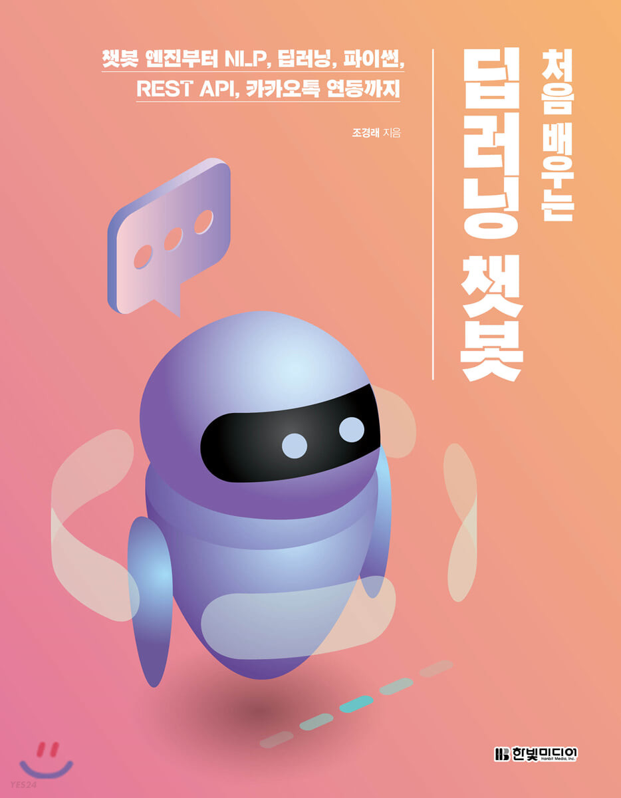

# 감정 인식 및 MBTI 분석 ChatBot

경북산업직업전문학교 "AI를 활용한 빅데이터 플랫폼 개발자과정"의 AI 학습 챗봇 프로젝트입니다.

---

|                          사용 교재                          |
| :---------------------------------------------------------: |
|                  |
| <a href="https://github.com/keiraydev/chatbot"> 깃허브 </a> |

|                        감정 인식에 사용한 우리말뭉치                         |
| :--------------------------------------------------------------------------: |
| <a href="https://github.com/songys/Chatbot_data">Chatbot_data_for_Korean</a> |

|                                                               MBTI 크롤링에 참고한 문서                                                                |
| :----------------------------------------------------------------------------------------------------------------------------------------------------: |
| <a href="https://shlee1990.tistory.com/864">[R] R 및 Python을 이용한 '디시인사이드' MBTI 갤러리 웹 크롤링 및 키워드 분석을 통한 워드 클라우드 생성</a> |
